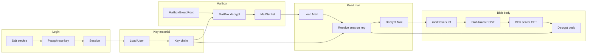

# Understanding this repo

This guide is here to help you read this repo by explaining how Tuta's APIs and encryption work. The CLI talks to Tuta's REST APIs; responses and some request bodies use **numeric attribute IDs** instead of field names like `subject` or `mailDetails`.

Encrypted entities (Mail, MailSet, MailDetailsBlob, etc.) require resolving **session keys** from a **key chain** built at login. The official client [tutao/tutanota](https://github.com/tutao/tutanota) is the source of truth (this repo's README cites the version/commit we align with). This doc focuses on the subset of types and flows used by this CLI: mail listing, reading a message body, and blob access.

---

## Key concepts

- **Entity / instance** – A single object of a given type (e.g. Mail, User); on the wire it is JSON keyed by attribute IDs.
- **Type model** – Schema for an entity type: app, name, version, and a map of attribute ID → (type, encrypted). Defines REST path, `v`/`dv` headers, and how to decrypt.
- **Attribute ID** – Numeric id (as string in JSON) for a field or association; e.g. `105` = subject, `1308` = mailDetails. Replaces human-readable keys on the wire.
- **Session key** – Per-entity AES key used to encrypt that entity's sensitive fields (and sometimes nested aggregates). Decrypted from `ownerEncSessionKey` using the right group key.
- **Group key** – Shared key for a group (e.g. user group, mail group). Used to decrypt session keys for entities owned by that group.
- **Key chain** – In this CLI: a map from `(groupId, keyVersion)` to group key, built after login from user and membership key material; used by `resolveSessionKey`.
- **Owner fields** – On encrypted entities: `ownerGroup`, `ownerEncSessionKey`, `ownerKeyVersion`; used to look up the group key and decrypt the session key.
- **Blob / blob server** – Large or binary data (e.g. mail body) stored as blob elements; served from a separate blob server URL; access requires a short-lived **blob access token** from the main app's storage service.

---

## The numeric wire format ("the codes")

**What.** The server (and some clients) send JSON with **numeric string keys** (e.g. `"105"`, `"1308"`) instead of names like `subject` or `mailDetails`. Each number is an **attribute ID** from Tuta's type system.

**Why.** Compact, stable wire format; the type model (which ID means what) is versioned per entity type.

**Where the IDs are defined:**

- In this repo: [src/crypto/typeModels.ts](../src/crypto/typeModels.ts) – minimal subset used for REST path, `v`/`dv` headers, decryption (which attributes are encrypted), and owner/session key fields.
- In the main app: `src/common/api/entities/sys/TypeModels.js`, `tutanota/TypeModels.js`, `storage/TypeModels.js` (and tuta-sdk's `type_models/*.json`).

**Conventions in this codebase:**

- Constants for IDs we care about (e.g. `MAIL_ATTR_MAIL_DETAILS = "1308"`, `BODY_ATTR_TEXT = "1275"`) live in [src/crypto/typeModels.ts](../src/crypto/typeModels.ts).
- Server instances are typed as `Record<string, unknown>`; see [src/crypto/decryptInstance.ts](../src/crypto/decryptInstance.ts) `ServerInstance`.

**Version headers.** Requests send `v` (type version) and optionally `dv` (depends-on version) so the server knows which schema the client expects. See [src/rest.ts](../src/rest.ts) `versionHeaders()` and its use in `loadEntity` and `loadMailDetailsBlobFromBlobServer`.

---

## Encryption in Tuta (high level)

**Layered model:**

1. **Passphrase** → **user group key** (decrypts `userGroup.symEncGKey`).
2. **User group key** → **mail group key** (decrypts the membership's `symEncGKey`).
3. **Group key** (user or mail) → **per-entity session key** (decrypts `ownerEncSessionKey` on each encrypted instance).
4. **Session key** → **encrypted field values** (and nested aggregates, e.g. body text).

**Owner fields on encrypted entities.** Each encrypted entity carries `ownerGroup`, `ownerEncSessionKey`, and (optionally) `ownerKeyVersion`. The client uses these to look up the right group key and then decrypt the session key. See [src/crypto/decryptInstance.ts](../src/crypto/decryptInstance.ts) `resolveSessionKey` and [src/crypto/typeModels.ts](../src/crypto/typeModels.ts) `getOwnerAttrs()`.

**128- vs 256-bit.** The CLI tries multiple decryption methods (256-legacy, 256, 128) for compatibility with older accounts. See [src/crypto/keyChain.ts](../src/crypto/keyChain.ts) and the `resolveSessionKey` comments.

**Former group keys.** When an entity's `ownerKeyVersion` differs from the current group key version (e.g. after key rotation), the CLI loads former keys from the Group's `formerGroupKeys`. See [src/crypto/formerGroupKey.ts](../src/crypto/formerGroupKey.ts) and the mailbox/envelope flows.

**Recognizable patterns.** If you've worked on other crypto or E2E systems, much of this will feel familiar. The concepts here are shared with many projects: KDF from passphrase (bcrypt/Argon2), key hierarchy, KEK/DEK (group key encrypts session key, session key encrypts data), per-entity keys, and blob token + separate blob service. The **wire format** (numeric attribute IDs, owner-field shape) and the **legacy 128/256 decryption order** are Tuta-specific. Mapping these ideas onto the code should be straightforward.

---

## Flow of access and keys (login → read mail body)

**Login.**

- Salt service (email → salt + KDF version) → derive **user passphrase key** (KDF: bcrypt or Argon2id per server) → build auth verifier → create session.
- See [src/auth/login.ts](../src/auth/login.ts), [src/auth/kdf.ts](../src/auth/kdf.ts).

**Session.** The stored access token is used for the REST `accessToken` header. The passphrase is not stored.

**User + key material.**

- Load the User entity (e.g. `/rest/sys/user/{id}`); parse **user key material** (userGroup, memberships with `symEncGKey`, group, groupKeyVersion).
- See [src/auth/userKeyMaterial.ts](../src/auth/userKeyMaterial.ts) (attribute IDs 95, 96, 27, 29, 1030, 2246, etc.).

**Key chain.**

- Derive **user group key** from passphrase + `userGroup.symEncGKey`; derive **mail group key** from user group key + mail membership's `symEncGKey`.
- `KeyChain` maps `(groupId, keyVersion)` → group key; used by `resolveSessionKey`.
- See [src/crypto/keyChain.ts](../src/crypto/keyChain.ts) `createKeyChain` / `unlockUserGroupKey`.

**Mailbox and folders.** Load MailboxGroupRoot → MailBox (decrypt with session key) → MailSet list → load MailSet entries (range). Former group keys are loaded when needed for decryption. See [src/cli/mailbox.ts](../src/cli/mailbox.ts).

**Reading a mail.**

1. Load the Mail entity (encrypted); resolve session key via key chain; decrypt Mail.
2. From Mail, read `mailDetails` (1308) = ref to MailDetailsBlob `[listId, elementId]`.
3. **Blob access:** MailDetailsBlob is a blob element. You cannot GET it from the main app domain. Request a **blob read token** from the storage service (POST with BlobReadData for the archive), then GET the blob from the **blob server** URL with `blobAccessToken` and `ids` query.
4. See [src/blobToken.ts](../src/blobToken.ts), [src/rest.ts](../src/rest.ts) `loadMailDetailsBlobFromBlobServer`, [src/cli/loadMailBody.ts](../src/cli/loadMailBody.ts).

---

## Diagram: from login to decrypted mail body

---

## Where to look next

**By concern:**

- **Auth:** [src/auth/login.ts](../src/auth/login.ts), [src/auth/kdf.ts](../src/auth/kdf.ts), [src/auth/userKeyMaterial.ts](../src/auth/userKeyMaterial.ts)
- **Crypto:** [src/crypto/typeModels.ts](../src/crypto/typeModels.ts), [src/crypto/keyChain.ts](../src/crypto/keyChain.ts), [src/crypto/decryptInstance.ts](../src/crypto/decryptInstance.ts), [src/crypto/formerGroupKey.ts](../src/crypto/formerGroupKey.ts)
- **REST:** [src/rest.ts](../src/rest.ts), [src/http.ts](../src/http.ts)
- **Blob:** [src/blobToken.ts](../src/blobToken.ts)
- **CLI commands:** [src/cli/mailbox.ts](../src/cli/mailbox.ts), [src/cli/commands/envelope.ts](../src/cli/commands/envelope.ts), [src/cli/commands/message.ts](../src/cli/commands/message.ts), [src/cli/loadMailBody.ts](../src/cli/loadMailBody.ts)

Run commands with `--verbose` to see request URLs and response shape. For setup and command reference, see the [README](../README.md).
